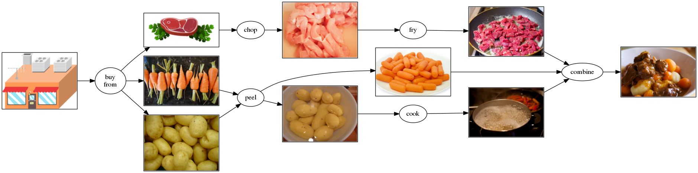

---
output:
  github_document:
    html_preview: false
---

<!-- README.md is generated from README.Rmd. Please edit that file -->

```{r, echo = FALSE}
knitr::opts_chunk$set(
  collapse = TRUE,
  comment = "#>",
  fig.path = "README-"
)
```

# cooking

[](https://travis-ci.org/krlmlr/cooking) [](https://cran.r-project.org/package=cooking)

Chopping, peeling, frying, and cooking various ingredients, and combining them to a delicious ragout. Also includes buying them from a local supermarket.



## Example

```{r echo=FALSE}
devtools::load_all(quiet = TRUE)
```

```{r example}
chopped_meat <- chop("raw_meat.csv")
chopped_meat
fry(chopped_meat, with = "vegetables")
peel(buy("carrots"))
buy("potatoes", from = "local market")
```

## Installation

```r
# install.packages("remotes")
remotes::install_github("krlmlr/cooking")
```
